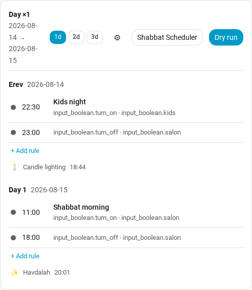

# Shabbat Scheduler

*Alpha. 763 tests passing (525 Python + end-to-end, 238 frontend), not yet
installed on the maintainer's own production instance.*

Shabbat Scheduler schedules Home Assistant to do anything — turn a light on,
run a scene, send a notification, adjust a thermostat — at specific times
across Shabbat and Chag, without you touching a switch. It's for anyone who
currently either does this by hand or cobbles it together with plain
time-based automations, and wants two guarantees an ordinary automation does
not give you: a rule **fires once and leaves the device alone** afterward
(no re-asserting state every time something else changes it), and
**overlapping rules are reported, never silently and arbitrarily resolved**
in whichever order the automation engine happens to run them.



*(The "Dry run" toggle — report what a rule would do without actually
calling anything — is turned on for this screenshot, so the header shows
something lit up. The master switch itself starts off on every fresh
install; see step 3 below for why.)*

## Quick start

1. **Install via HACS.** Add this repository to HACS as a custom repository
   of type *Integration*, download it, and restart Home Assistant.
2. **Add the integration.** Settings → Devices & Services → Add Integration
   → **Shabbat Scheduler**. If the [Jewish Calendar][jewish-calendar]
   integration is already installed, its candle-lighting and havdalah
   sensors are offered as the defaults — accept them unless you have a
   reason not to.
3. **The master switch starts off.** Nothing can happen yet: installing (and
   even authoring rules) cannot touch a single appliance until you
   deliberately turn `switch.shabbat_scheduler` on. This is deliberate —
   safe by default — so you can set everything up at your own pace before
   anything is live.
4. **Open the card.** It's a Lovelace card and it registers itself the
   moment the integration is added — there is nothing to add to your
   dashboard's resources. Add it to a dashboard:

   ```yaml
   type: custom:shabbat-scheduler-card
   title: שעון שבת
   ```

   Tap **+ Add rule** under a day and author your first one. A safe first
   rule to try: action `input_boolean.turn_on`, target one `input_boolean`
   entity — nothing about getting this wrong is dangerous, since it's just
   a toggle. Give the **action** (which service to call — `domain.service`,
   e.g. `input_boolean.turn_on`), a **target** (which entity, area, device
   or label it acts on), a **time**, and save.
5. **Turn the master switch on when you're ready.** Everything you've
   authored starts running on the next Shabbat or Chag it applies to.

[jewish-calendar]: https://www.home-assistant.io/integrations/jewish_calendar/

## Terminology

A **block** is one contiguous Shabbat/Chag period, derived entirely from the
Jewish Calendar integration's candle-lighting and havdalah sensors. Its length
in days — 1 for a regular Shabbat, 2 or 3 when a Chag abuts one — selects which
**profile** of rules applies. Rules are authored explicitly per block length,
so a rule always reads exactly as it will run.

Rules are deliberately **not** clamped to the zmanim: an erev rule at 17:00
fires before Shabbat begins, which is how you pre-cool; a last-day rule at
23:00 fires after havdalah. A rule is a clock time on a resolved date.

## Design commitments

- **Fire once, never re-assert.** A rule acts at its moment and then leaves the
  device alone. Turn something off by hand afterwards and it stays off.
- **Idempotent.** Each rule compares current state to desired and sends only
  what genuinely differs, reporting `changed` / `ok` / `failed` per attribute.
- **No precedence.** Overlapping rules are reported as conflicts, never
  silently resolved — there is no defined winner, so the choice stays yours.
- **Safe by default.** The master switch is **off** on a fresh install, so
  installing cannot touch an appliance until you deliberately enable it.
- **Restart-aware.** A restart part-way through a block re-applies the current
  desired state once, rather than losing the rules that already passed.

## Entities

| Entity | Purpose |
|---|---|
| `switch.shabbat_scheduler` | master on/off; off cancels every pending timer |
| one switch per rule | named after the rule, so its entity_id follows the rule's name rather than a fixed pattern — find it under Settings → Devices & Services → entities |
| `sensor.shabbat_scheduler_next_block` | day count, with the resolved dates |
| `sensor.shabbat_scheduler_next_action` | when the next rule fires |
| `sensor.shabbat_scheduler_last_run` | when a rule last ran, and what it did |

## The card

Installing the integration also installs a Lovelace card. It is registered
automatically — there is nothing to add to your resources.

```yaml
type: custom:shabbat-scheduler-card
title: שעון שבת
```

It shows the coming block as a timeline: one group per day with its date,
the candle-lighting and havdalah markers, and each rule's time, action,
target and data. Conflicts appear on the rows they affect; a conflict whose rules
are not currently on screen appears in the banner instead, so it cannot go
unseen. Conflicts are only ever warned about, never auto-resolved — the same
"no precedence" commitment above applies here too. The header carries the
master switch and the dry-run toggle; both are disabled for non-admin users,
who can still read the whole schedule.

The card shows only the rules matching the coming block's length, because
rules are authored per profile — a 3-day chag's rules are not shown on a
plain Shabbat.

Tap any rule to edit it, or use the **+ add** button under a day to create
one there — the day and block length are taken from where you tapped. The
dialog has a full editor for every field: **action** (a service picker),
**target** (Home Assistant's own target selector — entity, device, area or
label), **data** (the service's own payload form), **condition**, and
**replay**, alongside time, name, icon, color and the enabled flag — nothing
is shown read-only. YAML export/import (see Services, below) is still there
too, for bulk edits across the whole rule set at once; either path writes
the same rule shape, so use whichever is faster for what you're doing.

The **1d / 2d / 3d** chips switch which block length you are looking at, so a
3-day Chag can be set up long before one arrives. Any length other than the
coming one is shown as a preview: no dates, no candle-lighting or havdalah
markers, and a banner saying so. Editing works exactly the same there.

The gear opens the **shared defaults** — the target and data every rule
inherits unless it sets its own — with the same target and data editors the
rule dialog uses.

## Services

- `shabbat_scheduler.simulate` — resolve a block with no side effects. Answers
  "what happens this Shabbat?" and "what happens on a 3-day chag?".
- `shabbat_scheduler.set_dry_run` — report what would change, call nothing.
- `shabbat_scheduler.export_yaml` — dump the whole rule set.
- `shabbat_scheduler.import_yaml` — replace the whole rule set.

## Rule format

A rule **is** a Home Assistant service call: which one (`action`), what it
acts on (`target`), and what it carries (`data`) — the same three things
you'd fill in from Developer Tools → Actions. If Home Assistant can do it,
a rule can schedule it; nothing about the rule format is specific to
climate, lighting, or any other domain.

```yaml
profiles:
  1_day:
    erev:
      - id: a1
        at: "17:30:00"
        action: notify.mobile_app_phone
        data:
          message: Candle lighting in 30 minutes
      - id: a2
        at: "23:00:00"
        action: scene.turn_on
        target:
          entity_id: scene.shabbat_off
    day_1:
      - id: b1
        at: "11:00:00"
        name: Shabbat morning
        action: scene.turn_on
        target:
          area_id: living_room
```

- **`action`** is `domain.service` — any registered Home Assistant service,
  not a fixed on/off/custom vocabulary. `notify.mobile_app_phone`,
  `scene.turn_on`, `light.turn_on`, `script.boiler` are all equally rules;
  there is no allow-list.
- **`target`** is Home Assistant's own target selector: `entity_id`,
  `device_id`, `area_id`, or `label_id`, singly or as lists. Areas and
  labels are new in this format and are the ones worth using — target a
  label like `label_id: winter_lights` once, and every entity you tag with
  it later is covered without touching the rule again; target an area and
  a device added to that area later is covered too. A rule with no
  meaningful target (a `notify.*` call, for instance) simply omits it.
- **`data`** is the service's own payload, passed through untouched —
  whatever fields that `action` accepts, verbatim.
- **`condition`** (optional) is a list of Home Assistant's own condition
  configs — the same schema you'd write in an automation's `condition:`
  block (`state`, `numeric_state`, `sun`, `zone`, `and`/`or`/`not`, …). All
  conditions must pass at fire time or the rule is blocked, reported, and
  left alone:

  ```yaml
      - id: c1
        at: "18:00:00"
        action: light.turn_on
        target:
          area_id: living_room
        condition:
          - condition: sun
            after: sunset
  ```

- **`replay`** (optional, off by default) controls whether a rule is
  re-applied after a Home Assistant restart lands after the rule's moment
  but before the block ends. It is opt-in per rule because only the
  author knows what is safe to repeat — replaying "turn the lights off"
  is harmless, replaying "start the dishwasher" is not:

  ```yaml
        replay:
          enabled: true
          within: "02:00:00"
  ```

  `enabled` turns replay on at all. `within` bounds how late a replay may
  still happen — an 11:00 rule replayed at 23:00 does more harm than
  skipping it, so a replay older than `within` is reported as
  `skipped_stale` rather than fired. Omitting `within` means no bound,
  matching how every rule behaved before this option existed. A replay
  still passes through the rule's own `condition` before firing, exactly
  like a normal fire — so a rule can pass `enabled` and `within` and still
  not replay, blocked the same way it would be blocked at its original
  moment.

One authored action can still become more than one actual service call:
see [`docs/known-behaviours.md`](docs/known-behaviours.md) for the one
compatibility shim this integration keeps, and for how conflicts, replay
and migrated rules behave in more detail than fits here.

Rule ids are preserved across an export/import round trip, so re-importing
an edited file keeps each rule's entity, history and customisation.

## Known behaviours

Non-obvious behaviours and accepted trade-offs — the havdalah sensor rollover,
refresh serialisation, and what restart catch-up does across havdalah — are
documented in [docs/known-behaviours.md](docs/known-behaviours.md).

## Upgrading

Coming from v1? Rule shapes changed — a v1 `on`/`off`/`custom` rule against a
fixed device list is now any Home Assistant service call — and the upgrade
happens automatically the first time you restart with this version
installed. See [`docs/upgrading-from-v1.md`](docs/upgrading-from-v1.md) for
exactly what migrates, what gets flagged for your attention instead of
silently dropped, and what to check afterward.
